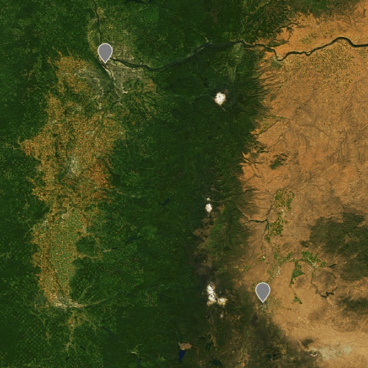

# Static Maps

The `Static` class from the `mapbox.services.static` module provides
access to the Mapbox Static Maps API. You can also import it directly from the
`mapbox` module.

```python
>>> from mapbox import Static

```

See https://www.mapbox.com/developers/api/static/ for general documentation
of the API.

Your Mapbox access token should be set in your environment; see the [access tokens](access_tokens.md) documentation for more information.

## Static methods

The methods of the `Static` class that provide access to the Static Maps API
return an instance of
[`requests.Response`](http://docs.python-requests.org/en/latest/api/#requests.Response).
The `content()` method returns the raw bytestring that can be saved into an image file 
with the appropriate extension.

## Usage

Static maps are standalone images that can be displayed on web and mobile devices without the aid of a mapping library or API. 

```python
>>> service = Static()

```

```python
>>> response = service.image('mapbox.satellite',
...                          lon=-61.7, lat=12.1, z=12)
>>> response.status_code
200
>>> response.headers['Content-Type']
'image/png'

```

Static maps can also display GeoJSON overlays and the [simplestyle-spec](https://github.com/mapbox/simplestyle-spec) styles will be respected and rendered.

```python
>>> portland = {
...    'type': 'Feature',
...    'properties': {'name': 'Portland, OR'},
...    'geometry': {
...        'type': 'Point',
...        'coordinates': [-122.7282, 45.5801]}}
>>> bend = {
...    'type': 'Feature',
...    'properties': {'name': 'Bend, OR'},
...    'geometry': {
...        'type': 'Point',
...        'coordinates': [-121.3153, 44.0582]}}

```

If features are provided, the lat, lon and z can be set automatically.

```python
>>> response = service.image('mapbox.satellite',
...                          features=[portland, bend])
>>> response.status_code
200
>>> response.headers['Content-Type']
'image/png'

```

Finally, the contents can be written to file.

```python
>>> with open('/tmp/map.png', 'wb') as output:
...     _ = output.write(response.content)

```



See ``import mapbox; help(mapbox.Static)`` for more detailed usage.

